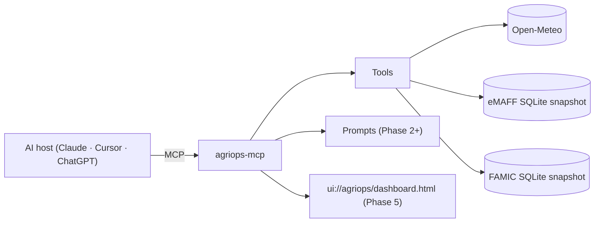

# AgriOps MCP

[](https://github.com/WIN-kagoshima/agriops-mcp/actions/workflows/ci.yml)
[](https://github.com/WIN-kagoshima/agriops-mcp/actions/workflows/codeql.yml)
[](https://securityscorecards.dev/viewer/?uri=github.com/WIN-kagoshima/agriops-mcp)
[](https://www.npmjs.com/package/@win-kagoshima/agriops-mcp)
[](LICENSE)
[](https://nodejs.org/)
[](https://modelcontextprotocol.io/specification/2025-11-25/)
[](https://github.com/modelcontextprotocol/ext-apps)

> **Reference implementation** of an MCP server using MCP Spec 2025-11-25, MCP Apps Extension 2026-01-26, and the official MCP TypeScript SDK v1.x.
> Apache-2.0 · TypeScript ESM · Node.js 20+ · stdio + Streamable HTTP.
>
> 日本語: [README.ja.md](./README.ja.md)

AgriOps MCP exposes Japanese agricultural data — farmland polygons (eMAFF), 1 km mesh weather (Open-Meteo, JMA), and pesticide registrations (FAMIC) — to AI agents through MCP. The audience is staffing companies that dispatch Specified Skilled Workers (特定技能 / SSW) to farms.

## Status

Pre-1.0, **experimental**. Tool names, prompt names, and resource URIs may change between minor versions until `1.0.0`. See [CHANGELOG.md](./CHANGELOG.md).

| Phase | Version | Capabilities |
|---|---|---|
| 0 | `0.1.0` | stdio transport · `get_weather_1km` |
| 1 | `0.1.x` | + Streamable HTTP · Server Card · `search_farmland`, `area_summary`, `nearby_farms`, `get_pesticide_rules` |
| 2 | `0.2.x` | + 5 user-controlled prompts (slash commands) |
| 3 | `0.3.x` | + Elicitation Form mode |
| 4 | `0.4.x` | + Elicitation URL mode + OAuth Client Credentials |
| 5 | `0.5.x` | + MCP Apps UI dashboard (map + weather overlay) |

## Capabilities at a glance



## Quickstart (stdio)

Requires Node.js 20+ and npm (pnpm/yarn also work).

```bash
git clone https://github.com/WIN-kagoshima/agriops-mcp.git
cd agriops-mcp
npm install
npm run build
npm run dev   # starts stdio transport
```

### Claude Desktop / Claude Code

Add to `~/Library/Application Support/Claude/claude_desktop_config.json` (macOS) or `%APPDATA%\Claude\claude_desktop_config.json` (Windows):

```json
{
  "mcpServers": {
    "agriops-mcp": {
      "command": "node",
      "args": ["/absolute/path/to/agriops-mcp/dist/server.js", "--stdio"]
    }
  }
}
```

### Cursor

Settings → MCP → Add MCP server:

```json
{
  "name": "agriops-mcp",
  "command": "node",
  "args": ["/absolute/path/to/agriops-mcp/dist/server.js", "--stdio"]
}
```

### MCP Inspector

```bash
npm run inspector
```

## Quickstart (Streamable HTTP, Phase 1+)

```bash
npm run build
npm run start:http      # listens on $PORT (default 3001)
```

The server exposes:

- `POST /mcp` — JSON-RPC over Streamable HTTP (per MCP Spec 2025-11-25).
- `GET /mcp` — server-initiated SSE notifications.
- `DELETE /mcp` — explicit session termination.
- `GET /.well-known/mcp-server.json` — Server Card for registries.
- `GET /healthz` — liveness probe (503 while draining).
- `GET /readyz` — readiness probe with per-adapter status.
- `GET /metrics` — Prometheus exposition (bearer-token gated when `AGRIOPS_METRICS_BEARER` is set).

Production deployment, key rotation, incident response, and SLO targets are documented in [`docs/runbook.md`](docs/runbook.md).

## Tools

| Name | Phase | Side effect | Summary |
|---|---|---|---|
| `get_weather_1km` | 0 | read-only | Hourly forecast at the given lat/lng. Open-Meteo, attributed CC-BY 4.0. |
| `get_weather_warning` | 1 | read-only | JMA active 警報・注意報 by prefecture. Cached ≤ 10 min, attribution `気象庁`. |
| `search_farmland` | 1 | read-only | Search eMAFF Fude polygons by address, prefecture, or crop. |
| `area_summary` | 1 | read-only | Aggregate farmland statistics over a polygon or admin code. |
| `nearby_farms` | 1 | read-only | Farmland within a radius of a centroid. |
| `get_pesticide_rules` | 1 | read-only | FAMIC pesticide registrations applicable to a crop / pest. |
| `create_staff_deploy_plan` | 3 | draft | Generates a non-binding staff deployment plan. Uses Form elicitation when input is missing. |
| `open_dashboard` | 5 | read-only (UI) | Opens the MCP Apps UI dashboard. Falls back to a structured summary on hosts without MCP Apps. |

App-only (UI-driven) tools and Phase 5+ low-level helpers are documented in [docs/api-reference.md](docs/api-reference.md).

### Client examples

Three runnable clients in [`examples/`](examples) — TypeScript stdio, Python (`mcp[cli]`) stdio, and `curl` over Streamable HTTP — that all call `get_weather_1km` against this server.

## Prompts (Phase 2+)

User-controlled slash commands. The MCP host decides when to surface them; the LLM does not auto-fire them.

| Slash command | Required args |
|---|---|
| `/field_summary` | `field_id` |
| `/pesticide_advice` | `crop`, `pest_or_disease` |
| `/staff_deploy_plan` | `farm_ids[]`, `period` |
| `/area_briefing` | `prefecture` |
| `/weather_risk_alert` | `farm_ids[]` |

## Data sources & licensing

This server only ships data sources that are open or whose licenses permit redistribution under documented constraints. See [docs/data-license.md](docs/data-license.md) for the full table.

| Source | License | Notes |
|---|---|---|
| eMAFF Fude Polygon | Public open data | SQLite snapshot built locally; not redistributed in npm package. |
| Open-Meteo | CC-BY 4.0 | Live API. Attribution included in tool output. |
| FAMIC pesticide | Public open data | SQLite snapshot built locally. |
| JMA disaster XML | Japan Meteorological Business Act | Phase 1+, short cache only. |
| WAGRI | Member agreement | **Out of scope for this OSS release** (Phase 7+, separate package). |

## Security

- No secrets in tool output, logs, errors, or UI bundles.
- DNS rebinding protection enabled on Streamable HTTP transport.
- Origin / Host allowlist on HTTP transport.
- See [SECURITY.md](./SECURITY.md) for vulnerability reporting.

## Contributing

See [CONTRIBUTING.md](./CONTRIBUTING.md). All contributions must be Apache-2.0 compatible.

## License

Apache-2.0. © 2026 WIN Kagoshima
